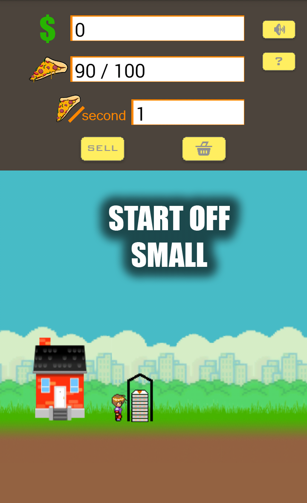
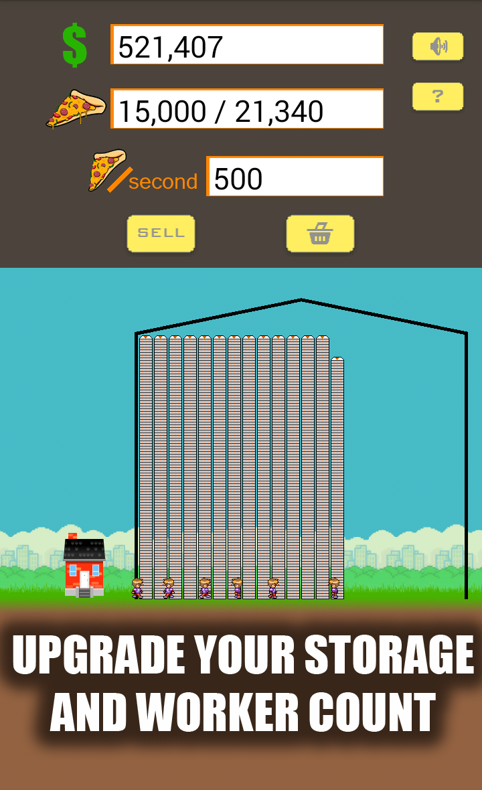
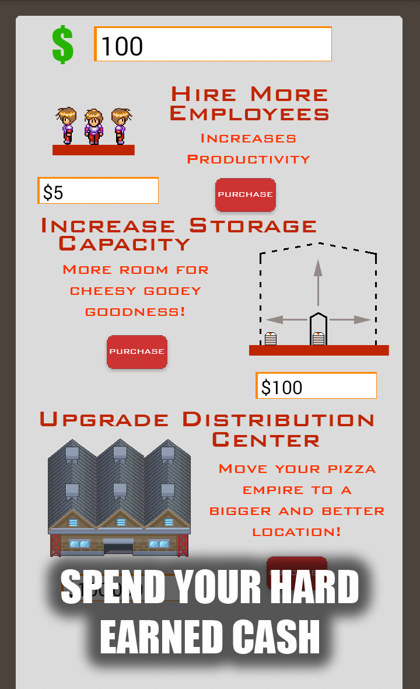

# Pizza Planet

**Build up your pizza empire to dominate on a planetary scale.**

It's a bright and sunny day amidst the greatest economic growth the world has ever seen. Just a normal college student, you're young, inexperienced, and... a little bit hungry. And like everyone else on the planet, you want nothing more than to get rich quick. But how? Your stomach grumbles and you decide to think about it over a snack. Remembering that there should be some leftover pizza from last night, you check the fridge. Alas, no pizza! Your idiot roommate must have finished it earlier that morning. And of course, there aren't any pizza delivery places on campus! That's when it hits you... why not start your own pizza company so that no one else needs to suffer like you did? Following your new-found dreams, you drop out of college, move back home, and start making pizza in your mother's kitchen. Was that a good decision? Probably not. Either way, it's now up to you to turn your life around and put together the best pizza company on the planet!

* Grow your young start-up into a bustling pizza empire by making and selling your cheesy gooey goodness to an endless supply of hungry invisible buyers. 
* Put your money back into the company and watch it grow as you hire more employees, upgrade your facilities, and move to new exciting locations. 
* Keep expanding until you build up an intergalactic pizza empire centered around your own Pizza Planet.

 |  | 
---|----|---
 |  |   
